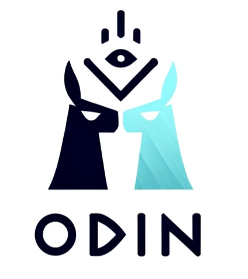
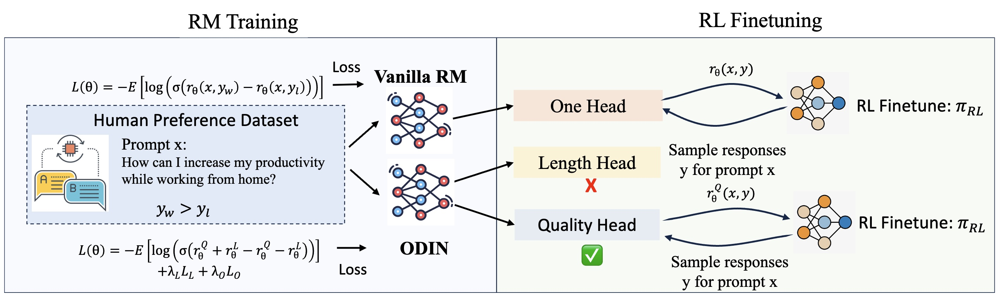
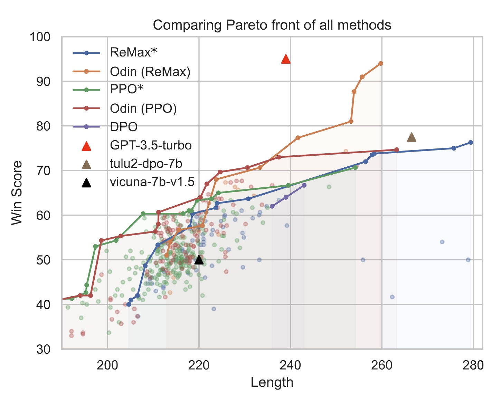

<div align="center">
    
</div>

<div align="center">

# ODIN: Disentangled Reward Mitigates Hacking in RLHF (ICML 2024)

Lichang Chen*, Chen Zhu*, Davit Soselia, Jiuhai Chen, Tianyi Zhou, Tom Goldstein, Heng Huang, Mohammad Shoeybi, Bryan Catanzaro

*denotes equal contribution, order is random.

### [Paper](https://arxiv.org/abs/2402.07319) | [Code](https://github.com/Lichang-Chen/ODIN)
</div>

## Introduction
Since a well-formated, verbose but less helpful response from the LLMs can often deceive human annotators/LLMs and achieve high scores. 
To address such a hacking issues in preference optimization, we establish a more reliable reward model, ODIN, which disentangled the length feature in the reward.
By applying ODIN to PPO and ReMax, we achieve significant higher Pareto front than the baselines.

The overview of our method:
<div align="center">
    
</div>
ODIN has two heads to predict two rewards, but only uses one for RL. In RM training stage, ODIN is trained with the same human preference data as vanilla RM with a carefully designed loss to disentangle the length signal and the quality signal into two heads. Only the quality head is involved in RL fine-tuning stage, and the length reward is discarded to reduce reward hacking on length


## Environment Setup
We recommend using docker for all the experiments:
```
% Docker image link
https://hub.docker.com/r/morningpig/dsp_rlhf
```

## Reward Model training
```
% Reward model training is important to the success
% The details about the parameters are in the script file
bash scripts/train_rm.sh
```

## RL Finetuning
```
% set up the path in the script file before submitting the job
sbatch scripts/ppo.slurm
```

## Evaluation
```
% Please refer to the evaluation folder for more details.
bash scripts/eval.sh
```

## Results
<div align="center">
    
</div>
The main results of ODIN. We compare the Pareto front of models trained with PPO and ReMax using the vanilla reward model and ODIN, as well as models trained with DPO~\citep{DPO} on human preference data. For ReMax* and PPO*, we aggregated results with reward clipping and length penalty for comparison, which involves a larger search space and more compute budget than the ODIN results.


## Bibtex
If you find our repo is useful, please consider citing our paper:
```
@inproceedings{
    author={Lichang Chen and Chen Zhu and Jiuhai Chen and Davit Soselia and Tianyi Zhou and Tom Goldstein and Heng Huang and Mohammad Shoeybi and Bryan Catanzaro},
    booktitle={Forty-first International Conference on Machine Learning},
    year={2024},
    url={https://openreview.net/forum?id=zcIV8OQFVF}
}
```


